# ad-video-gen-java

**AIVision Control** — 可控式 AI 营销视频工作台。上传商品图或参考视频，经多 Agent 编排完成策划、分镜、图片/视频生成与评估，人工确认后 FFmpeg 合成成片，并自动生成发布文案与话题标签。

后端 **Spring Boot 3 + H2**，前端 **React + Vite + TypeScript**，模型接入火山方舟（Doubao / Seedream / Seedance）。

---


## 项目简介

本项目将「理解需求 → 写脚本 → 生图 → 生视频 → 合成发布」拆成**可审核、可回退**的多阶段流水线，适合两类场景：

| 工作流 | 标识 | 输入 | 流程特点 |
|--------|------|------|----------|
| **商品图生成广告** | `product_image_ad` | 商品图 + 文字需求 | 含营销策划 → 分镜脚本 → 图片/视频候选 → 合成 |
| **视频素材拆解重制** | `video_storyboard_ad` | 参考视频 + 文字需求 | 跳过营销策划，先做视频理解与分镜，再进入图片/视频生成 |

**核心交互原则**

- **一阶段一主操作**：顶栏主 CTA 为「进入下一步」/「开始生成」，阶段内底部单独保存
- **先保存再前进**：有未保存修改时点击「进入下一步」弹出确认（保存并继续 / 放弃 / 取消）
- **人机协同**：每组分镜支持多候选图片/视频；可开启 AI 评分，候选卡片展示分数与依据
- **Stepper 回顾**：点击已完成节点可只读查看历史内容；顶栏显示「返回当前阶段」
- **执行中遮罩**：任务 `RUNNING` 时，仅**当前正在执行的阶段**显示遮罩并每 2.5s 自动刷新；回顾已完成节点时不遮罩
- **重燃**：右侧抽屉从指定阶段修改输入并重跑后续；图片/视频重燃表单**仅编辑参数**，不展示历史候选素材

---

## 技术栈

### 核心框架

| 层级 | 组件 | 版本 |
|------|------|------|
| 语言 | Java | 17 |
| 后端框架 | Spring Boot | 3.3.6 |
| Web / 校验 | spring-boot-starter-web、spring-boot-starter-validation | 随 Boot 3.3.6 |
| 持久化 | Spring Data JPA + Hibernate ORM | 6.5.3.Final |
| 监控 | Spring Boot Actuator | 随 Boot 3.3.6 |
| 工具库 | Hutool | 5.8.36 |
| 前端框架 | React + React DOM | 18.3.1 |
| 构建工具 | Vite + @vitejs/plugin-react | 5.4.21 / 4.7.0 |
| 语言 | TypeScript | 5.9.3 |
| 图标 | Lucide React | 0.468.0 |
| 打包构建 | Node.js / npm（frontend-maven-plugin） | v20.18.1 / 10.8.2 |

### 依赖中间件

| 中间件 | 用途 | 版本 / 说明 |
|--------|------|-------------|
| **H2 Database** | 嵌入式任务与上下文持久化 | 2.2.224（文件库 `./data/ad-video-gen.mv.db`） |
| **S3 兼容对象存储** | 商品图、参考视频、候选素材 URL（MinIO / RustFS 等） | AWS SDK for Java S3 **2.25.27** |
| **FFmpeg** | 分镜视频拼接、最终成片合成 | 系统二进制（`FFMPEG_BINARY`，默认 `ffmpeg`） |
| **火山方舟 Ark API** | LLM / 文生图 / 图生视频 | Doubao-Seed-1.6、Seedream 4.5 pro、Seedance 1.0 pro |

> **本地联调兜底**：未配置 `S3_ACCESS_KEY` / `S3_SECRET_KEY` 时，上传接口返回 mock URL；未配置 `ARK_API_KEY` 时，LLM / 生图 / 生视频客户端返回 mock 内容，便于跑通流程。

### AI 模型（火山方舟）

| 能力 | 模型 |
|------|------|
| LLM | Doubao-Seed-1.6（理解、Agent 推理） |
| 图像 | Doubao-Seedream 4.5 pro（文生图 / 参考图生图） |
| 视频 | Doubao-Seedance 1.0 pro（图文生视频） |

---

## 前端工作台

单页应用（`frontend/src/main.tsx` + `frontend/src/styles.css`）：左侧任务栏 + 顶栏 Stepper + 阶段画布。代码集中在 `main.tsx` 单文件。

| 阶段 | 布局要点 |
|------|----------|
| **创建** | 流程说明 + 素材/需求 + 生成配置；切换商品图 / 视频素材工作流 |
| **营销策划** | 只读双栏（AI 方案 + 配置摘要）；仅商品图流程 |
| **分镜脚本** | 左侧分镜导航 + 右侧分镜卡片（scroll-spy，青色高亮当前项） |
| **视频理解与分镜** | 左侧理解结果 + 右侧分镜导航与详情（视频素材流程） |
| **图片/视频评估** | 左侧分镜导航 + 右侧候选卡片网格；选中态青色边框 |
| **重燃抽屉** | 下拉选阶段；各节点仅展示该阶段可改入参（见下方截图）；图片/视频节点不展示历史候选，视频节点可选候选图 |
| **完成** | 成片预览 + 发布文案 / 话题 / 下载链接 |

**核心交互**：Stepper 回顾已完成节点（只读）；`RUNNING` 时仅当前阶段显示遮罩；有未保存修改时「进入下一步」弹确认；重燃从指定阶段重跑并清空后续产物；失败时 `ErrorPanel` 支持重燃或返回当前阶段。

---

## 后端流程

### Agent 与编排

| 组件 | 职责 |
|------|------|
| `MarketAgent` | 目标人群、卖点、创意策略（商品图流程） |
| `DirectorAgent` | 标题、分镜脚本与提示词 |
| `VideoStoryboardAgent` | 参考视频理解与分镜（视频素材流程） |
| `WorkflowOrchestratorServiceImpl` | 状态机推进、`start`/`advance` 异步执行、图片/视频评分、选片、FFmpeg 合成 |
| `SeedreamImageClient` | 分镜候选图生成 |
| `SeedanceVideoClient` | 分镜候选视频生成 |
| `ReleaseAgent` | 发布标题、文案、话题标签 |
| `FfmpegComposeService` | 分镜视频拼接为成片 |
| `S3StorageService` | 素材与成片对象存储 |

提示词位于 `src/main/resources/prompts/`，由 `PromptService` 按 `## PROMPT_XXX` 段落加载。

### 状态机

后端细粒度阶段在前端通过 `canonicalStage` **归并展示**：

| 后端阶段 | 前端 Stepper |
|----------|----------------|
| `IMAGE_EVALUATING` / `IMAGE_SELECTING` | 图片生成与评估 |
| `VIDEO_EVALUATING` / `VIDEO_SELECTING` | 视频生成与评估 |

**商品图流程** Stepper：

```text
创建 → 营销策划 → 分镜脚本 → 图片生成与评估 → 视频生成与评估 → 最终合成 → 完成
```

**视频素材流程** Stepper（无营销策划）：

```text
创建 → 视频理解与分镜 → 图片生成与评估 → 视频生成与评估 → 最终合成 → 完成
```

**任务状态**：`CREATED` → `RUNNING`（异步推进单步）→ `WAITING_REVIEW`（待人工确认）→ `SUCCESS` / `FAILED`（亦支持 `CANCELED`）。

- `POST .../start` 与 `POST .../advance` 均为**异步**触发一步编排，前端轮询详情直至阶段或状态变化
- 开启「自动确认」且满足条件时可跳过人审；否则各审核节点需保存后手动「进入下一步」
- 保存分镜 / 选择或重燃后，会清空受影响的后续产物

---

## 快速开始

### 一键打包运行

```bash
mvn clean package
java -jar target/ad-video-gen-java-0.0.1-SNAPSHOT.jar
```

访问：`http://localhost:8080/`（前端已打入 JAR 的 `static` 目录）

### 前后端分离开发

```bash
# 终端 1
mvn spring-boot:run

# 终端 2
cd frontend && npm install && npm run dev
```

- 前端：`http://localhost:8002/`
- 开发态 API **直连** `http://127.0.0.1:8080`（可通过 `VITE_API_BASE` 覆盖）
- 后端需已启动，否则接口报连接失败

---

## 环境变量

以下变量对应 `src/main/resources/application.yml` 中 `ad-video.*` 配置（Spring Boot relaxed binding）：

```bash
# 火山方舟（LLM / 生图 / 生视频共用 API Key）
export ARK_API_KEY=你的方舟APIKey
export LLM_MODEL=doubao-seed-1-6-250615
export LLM_ENDPOINT_ID=你的LLM接入点ID

export IMAGE_MODEL=doubao-seedream-4-5-pro
export CGT_ENDPOINT_ID=你的Seedream接入点ID

export VIDEO_MODEL=doubao-seedance-1-0-pro
export T2V_ENDPOINT_ID=你的Seedance接入点ID

# 成片访问与 FFmpeg
export PUBLIC_BASE_URL=http://localhost:8080
export FFMPEG_BINARY=ffmpeg
export FFMPEG_OUTPUT_DIR=./data/final-videos

# S3 兼容对象存储
export S3_ENDPOINT=http://127.0.0.1:9000
export S3_PUBLIC_BASE_URL=http://127.0.0.1:9000
export S3_ACCESS_KEY=你的AccessKey
export S3_SECRET_KEY=你的SecretKey
export S3_BUCKET=ad-video-gen-java
export S3_REGION=us-east-1
export S3_PATH_STYLE_ACCESS=true
export S3_AUTO_CREATE_BUCKET=true
export S3_OBJECT_EXPIRATION_DAYS=7
```

| 变量 | 说明 |
|------|------|
| `ARK_API_KEY` | 未配置时 Ark 客户端使用 mock 文本/图片/视频，便于无密钥联调 |
| `LLM_ENDPOINT_ID` / `CGT_ENDPOINT_ID` / `T2V_ENDPOINT_ID` | 方舟接入点 ID；未填时回退为 `model` 字段 |
| `PUBLIC_BASE_URL` | 短链与 mock 视频 URL 前缀；亦用于 Release 成片链接 |
| `FFMPEG_OUTPUT_DIR` | 本地成片目录；通过 `/final-videos/**` 提供 HTTP 访问 |
| `S3_ACCESS_KEY` / `S3_SECRET_KEY` | 未配置时上传返回 `mock://local/...` URL |
| `S3_OBJECT_EXPIRATION_DAYS` | `uploads/` 前缀对象过期天数；`final-videos/` 不过期 |

---

## API 概览

基础路径：`/api/video-tasks`。统一响应：`{ "code": 0, "message": "success", "data": ... }`。

| 方法 | 路径 | 说明 |
|------|------|------|
| `POST` | `/api/video-tasks` | 创建任务（`CreateVideoTaskRequest`） |
| `GET` | `/api/video-tasks` | 任务列表摘要（侧边栏） |
| `GET` | `/api/video-tasks/{id}` | 任务详情（`TaskDetailResponse`） |
| `POST` | `/api/video-tasks/{id}/start` | 启动流程（`CREATED` → 异步执行首步） |
| `POST` | `/api/video-tasks/{id}/advance` | 推进一步（异步） |
| `POST` | `/api/video-tasks/{id}/context` | 保存分镜编辑 / 视频阶段图片上下文（`UpdateWorkflowContextRequest`） |
| `POST` | `/api/video-tasks/{id}/select-assets` | 保存图片/视频选择（`SelectAssetsRequest`） |
| `POST` | `/api/video-tasks/{id}/regenerate` | 从指定阶段重燃（`RegenerateVideoTaskRequest`） |
| `POST` | `/api/video-tasks/upload-image` | 上传商品图（`multipart/form-data`，字段 `file`） |
| `POST` | `/api/video-tasks/upload-video` | 上传参考视频（`multipart/form-data`，字段 `file`） |

静态资源：`GET /final-videos/**` → `FFMPEG_OUTPUT_DIR` 目录下的成片文件。

### 创建任务（商品图）

```bash
curl -X POST http://localhost:8080/api/video-tasks \
  -H 'Content-Type: application/json' \
  -d '{
    "workflowType": "product_image_ad",
    "inputType": "product_image",
    "text": "参考商品图片，生成一条 15 秒带货广告视频。",
    "imageUrls": ["https://example.com/product.jpg"],
    "platform": "douyin",
    "duration": 15,
    "aspectRatio": "9:16",
    "style": "电影感",
    "imageScoringEnabled": true,
    "videoScoringEnabled": true,
    "autoConfirmEnabled": false,
    "generateImageCount": 4,
    "generateVideoCount": 2
  }'
```

创建后调用 `POST /api/video-tasks/{taskId}/start` 开始生成。

### 重燃

```bash
curl -X POST http://localhost:8080/api/video-tasks/{taskId}/regenerate \
  -H 'Content-Type: application/json' \
  -d '{
    "fromStage": "SHOT_SCRIPT_GENERATING",
    "reason": "调整创意策略后重跑",
    "taskInput": { "text": "...", "duration": 15, "aspectRatio": "9:16" },
    "videoConfig": { "targetAudience": "...", "videoAdvice": "..." },
    "shots": []
  }'
```

`fromStage` 可选：`MARKET_PLANNING`（仅商品图）、`SHOT_SCRIPT_GENERATING`、`IMAGE_GENERATING`、`VIDEO_GENERATING`、`FINAL_COMPOSING`。各阶段可携带字段见前端 `regeneratePayload` 与 `RegenerateVideoTaskRequest`。

---

## Docker 部署

镜像基于 Eclipse Temurin 17 JRE（UBI minimal）。FFmpeg 随仓库提供为 [`docker/ffmpeg/ffmpeg.zip`](docker/ffmpeg/ffmpeg.zip)（Linux x64）。**构建镜像前**需将其解压为 `docker/ffmpeg/ffmpeg`（该二进制已在 `.gitignore` 中，不入库）：

```bash
unzip -o -j docker/ffmpeg/ffmpeg.zip ffmpeg -d docker/ffmpeg/
chmod +x docker/ffmpeg/ffmpeg

mvn clean package
docker build -t ad-video-gen-java .

docker run -d \
  --name ad-video-gen-java \
  -p 48080:48080 \
  -e ARK_API_KEY=... \
  -e LLM_ENDPOINT_ID=... \
  -e CGT_ENDPOINT_ID=... \
  -e T2V_ENDPOINT_ID=... \
  -e PUBLIC_BASE_URL=http://your-host:48080 \
  -e S3_ENDPOINT=http://your-s3-host:9000 \
  -e S3_PUBLIC_BASE_URL=http://your-s3-public-host:9000 \
  -e S3_ACCESS_KEY=... \
  -e S3_SECRET_KEY=... \
  -e S3_BUCKET=ad-video-gen-java \
  -e S3_REGION=us-east-1 \
  -e S3_PATH_STYLE_ACCESS=true \
  -e S3_AUTO_CREATE_BUCKET=true \
  -e S3_OBJECT_EXPIRATION_DAYS=7 \
  -v "$(pwd)/docker-data/db:/app/data/db" \
  -v "$(pwd)/docker-data/videos:/app/data/videos" \
  ad-video-gen-java
```


| 地址 | 说明 |
|------|------|
| `http://localhost:48080/` | 工作台 |
| `http://localhost:48080/h2-console` | H2 控制台 |
| `jdbc:h2:file:/app/data/db/ad-video-gen;MODE=MySQL` | 容器内 JDBC |

---

## 数据持久化

| 项 | 值 |
|----|-----|
| 数据文件 | `./data/ad-video-gen.mv.db` |
| JDBC | `jdbc:h2:file:./data/ad-video-gen;MODE=MySQL;AUTO_SERVER=TRUE` |
| 用户名 / 密码 | `sa` / 空 |

- `video_task`：任务元数据、`request_json`
- `video_task_context`：完整上下文 `context_json`（分镜、候选组、选择结果、成片等）

---

## 项目结构

```text
ad-video-gen-java/
├── docs/screenshots/          # README 界面截图（01–09 + regenerate/）
│   └── regenerate/            # 重燃抽屉各阶段表单
├── frontend/
│   ├── src/main.tsx           # React 工作台（单文件组件）
│   └── src/styles.css
├── src/main/java/.../advideo/
│   ├── agent/                 # Market / Director / VideoStoryboard / Release
│   ├── client/                # ArkChat / Seedream / Seedance
│   ├── orchestrator/          # 工作流编排、评分、重燃、状态机
│   ├── controller/            # REST API（VideoTaskController）
│   ├── service/               # S3、FFmpeg、Prompt
│   ├── config/                # WebMvc（CORS、/final-videos）、AdVideoProperties
│   ├── domain/                # 模型与枚举（TaskStage、Shot 等）
│   └── entity/ + repository/  # JPA 持久化
└── src/main/resources/
    ├── application.yml
    └── prompts/               # Agent 提示词
```

---

## 界面预览

| 创建任务（商品图） | 创建任务（视频素材） |
|:---:|:---:|
|  | 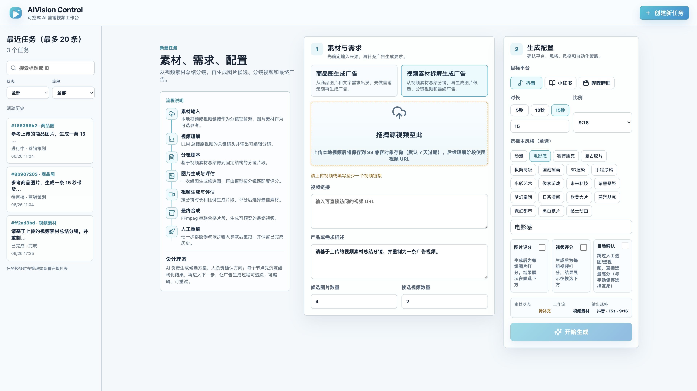 |

| 营销策划 | 分镜脚本 |
|:---:|:---:|
| 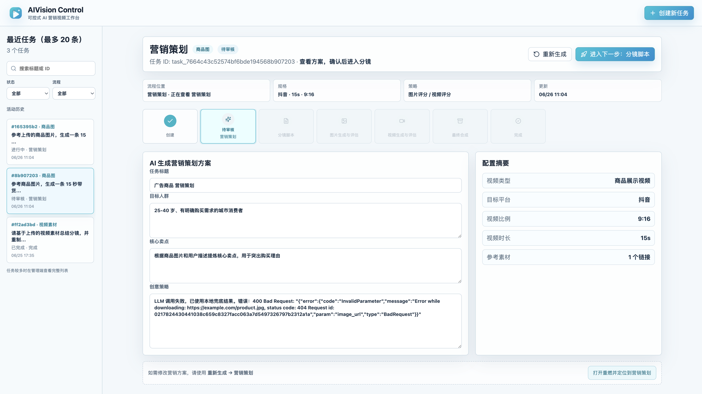 | 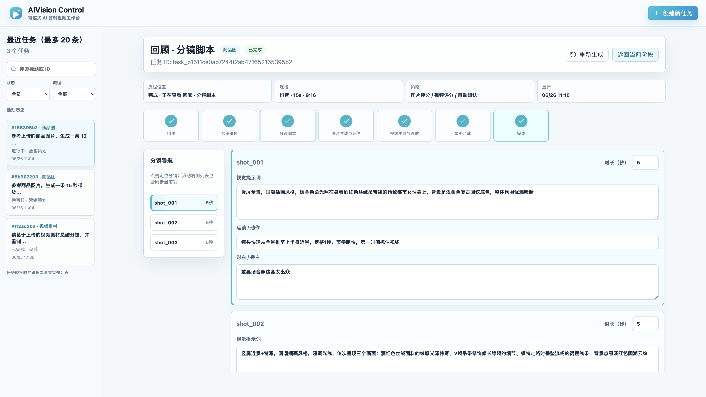 |

| 视频理解与分镜 | 图片生成与评估 |
|:---:|:---:|
| 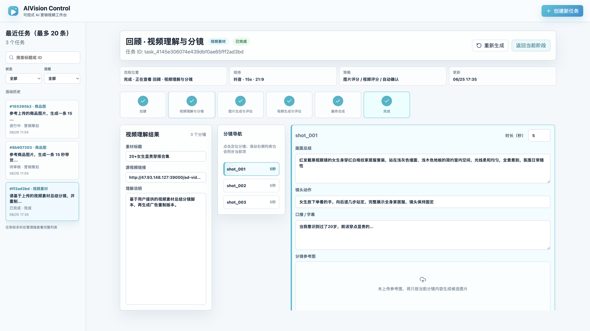 | 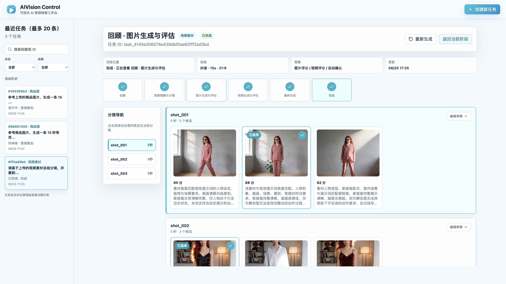 |

| 视频生成与评估 | 完成页 |
|:---:|:---:|
| 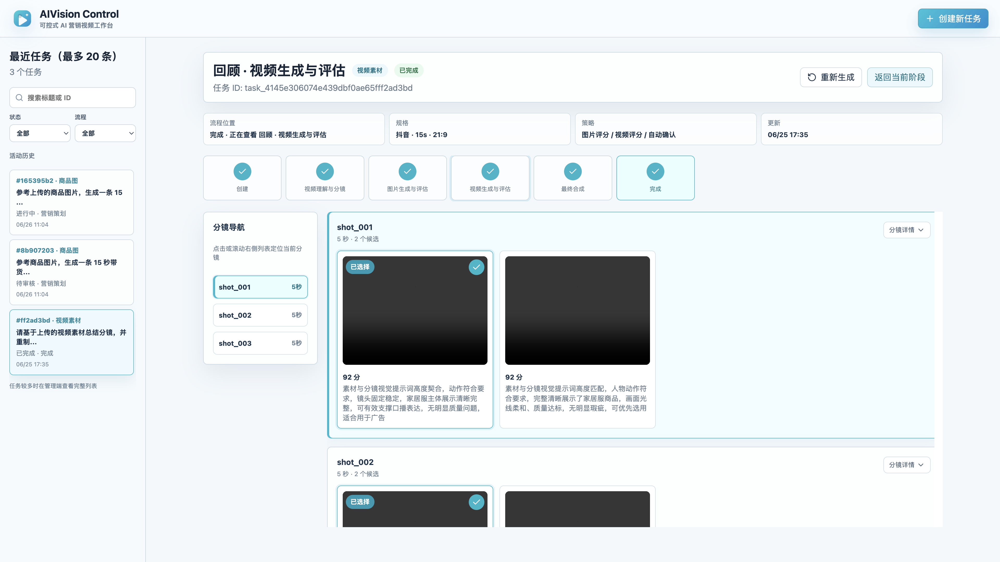 | 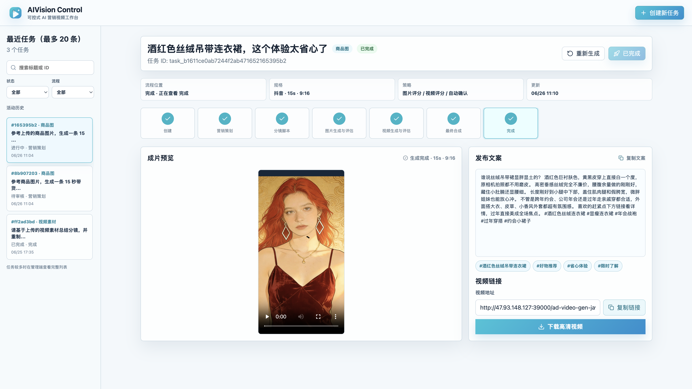 |

### 重燃抽屉（各阶段表单）

**商品图流程**（5 个可重燃节点）：

| 营销策划 | 分镜脚本 |
|:---:|:---:|
| 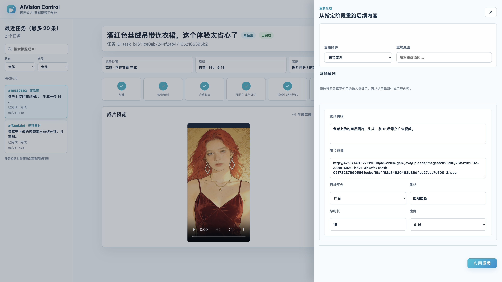 | 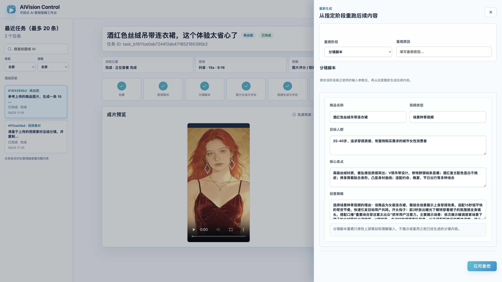 |

| 图片生成与评估 | 视频生成与评估 |
|:---:|:---:|
| 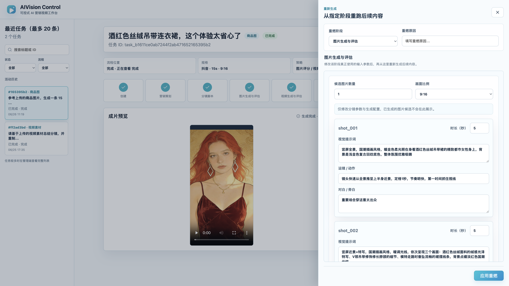 | 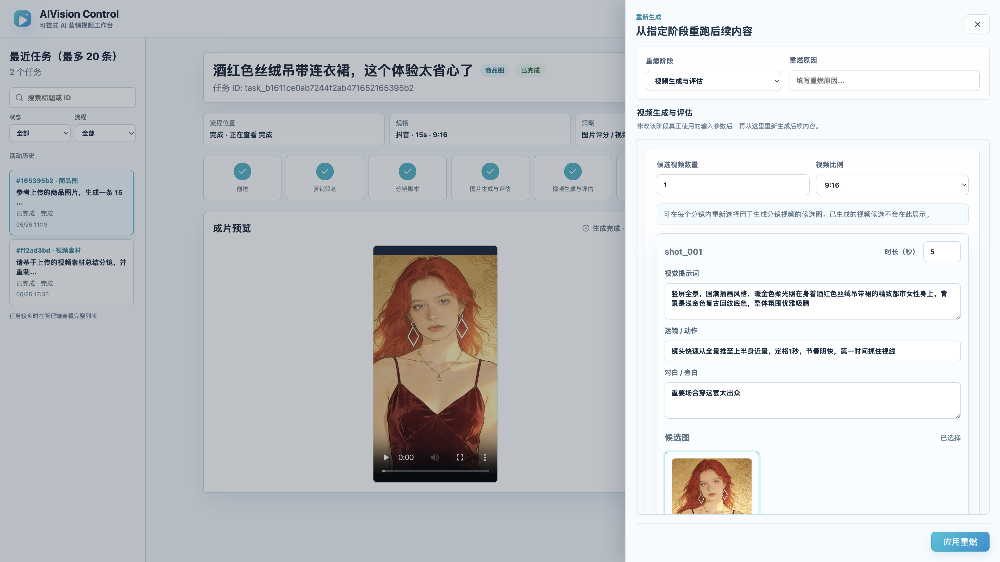 |

| 最终合成 | |
|:---:|:---:|
| 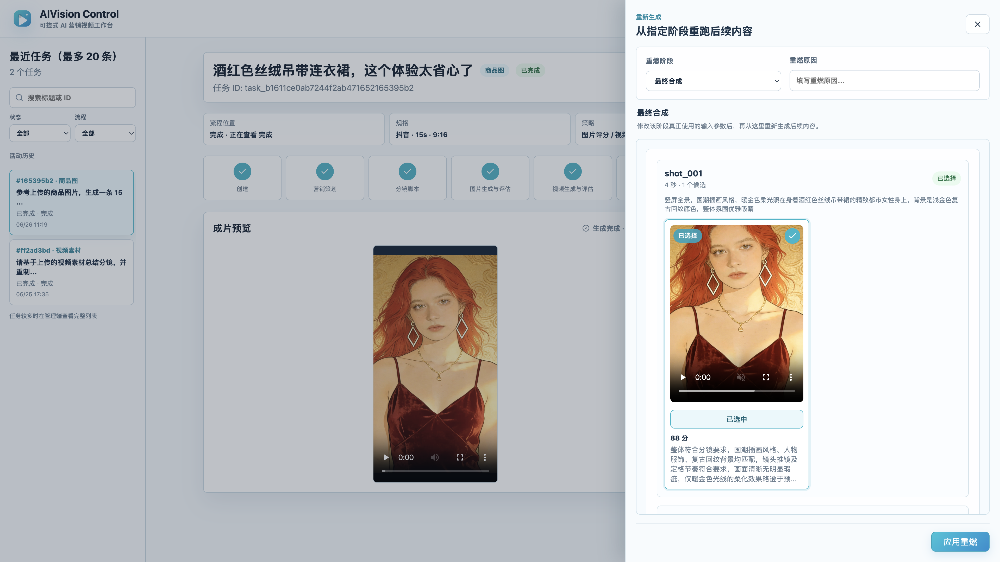 | |

**视频素材流程**（4 个可重燃节点，无营销策划）：

| 视频理解与分镜 | 图片生成与评估 |
|:---:|:---:|
| 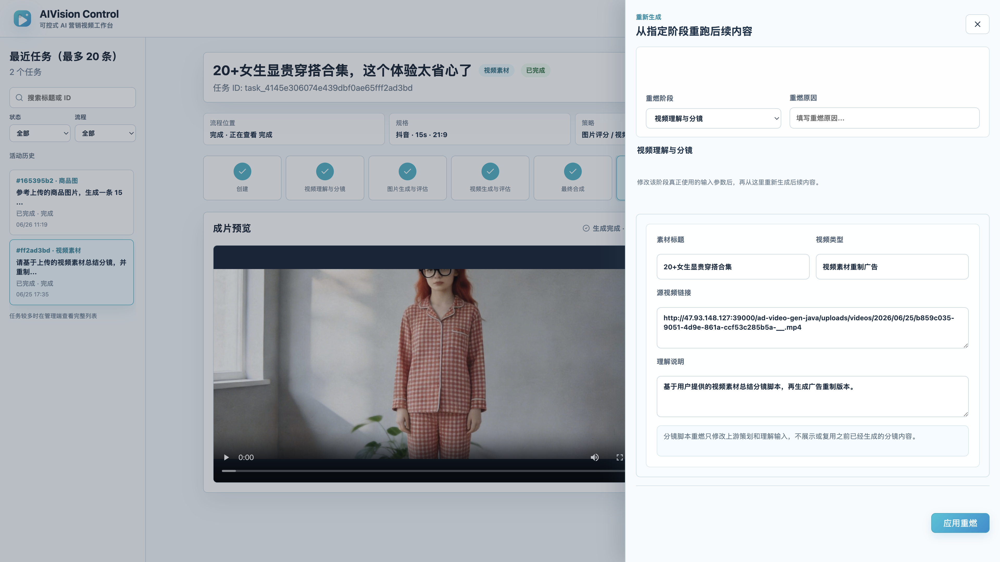 | 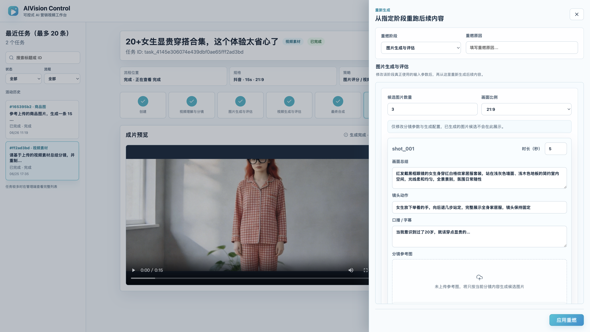 |

| 视频生成与评估 | 最终合成 |
|:---:|:---:|
| 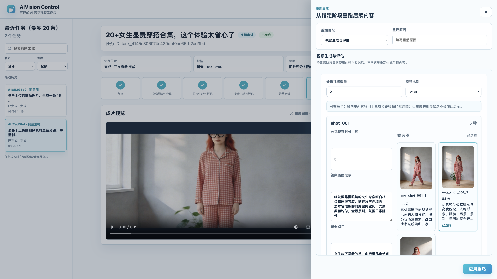 | 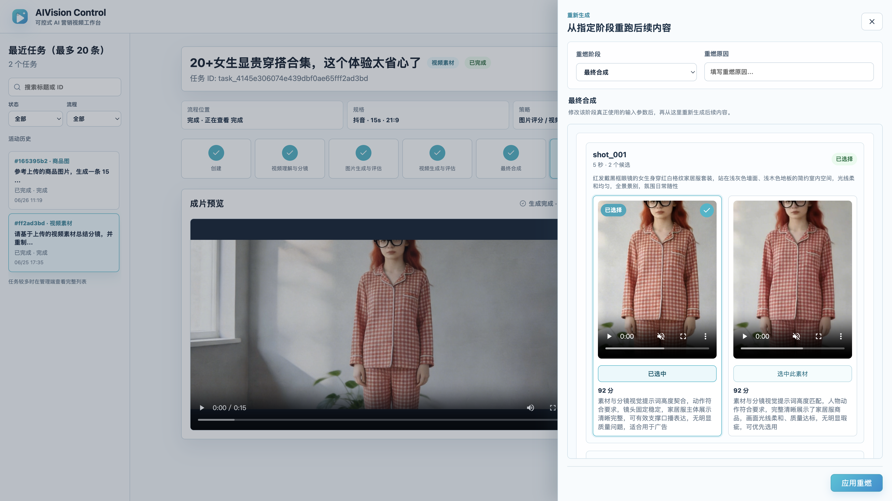 |

---

## 相关文档
