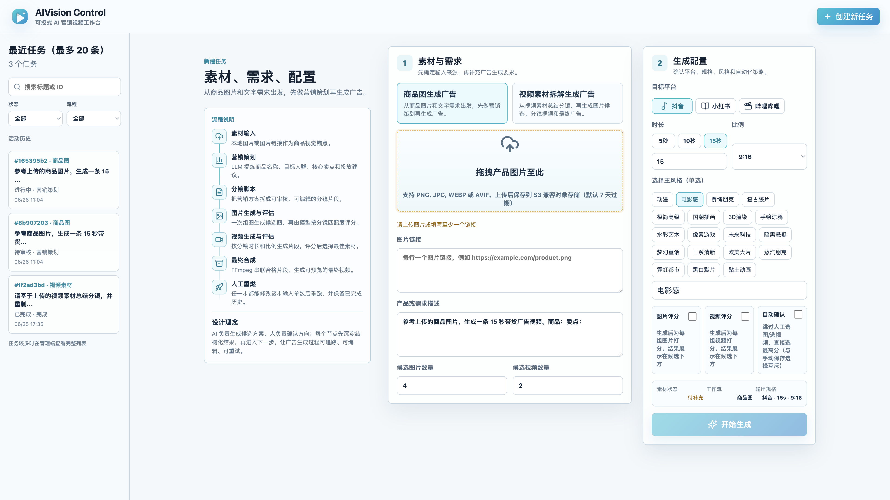
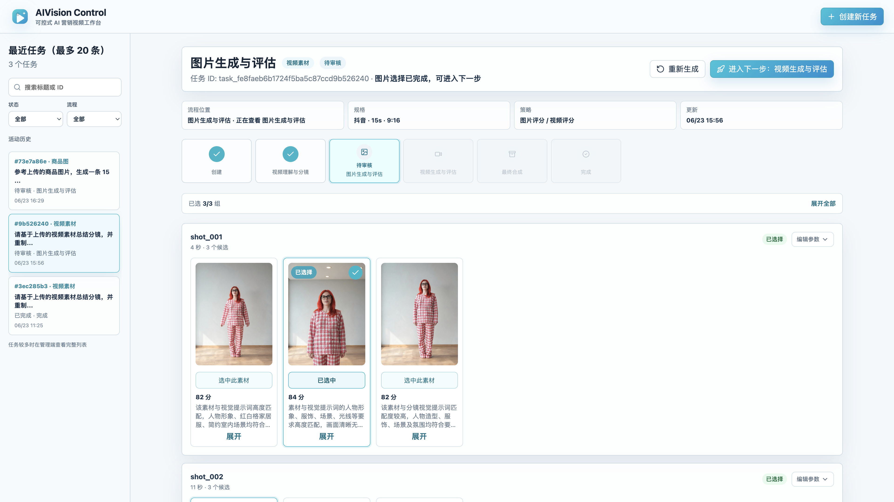
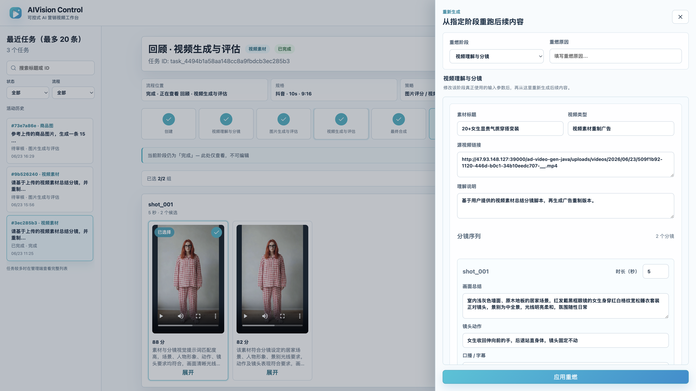
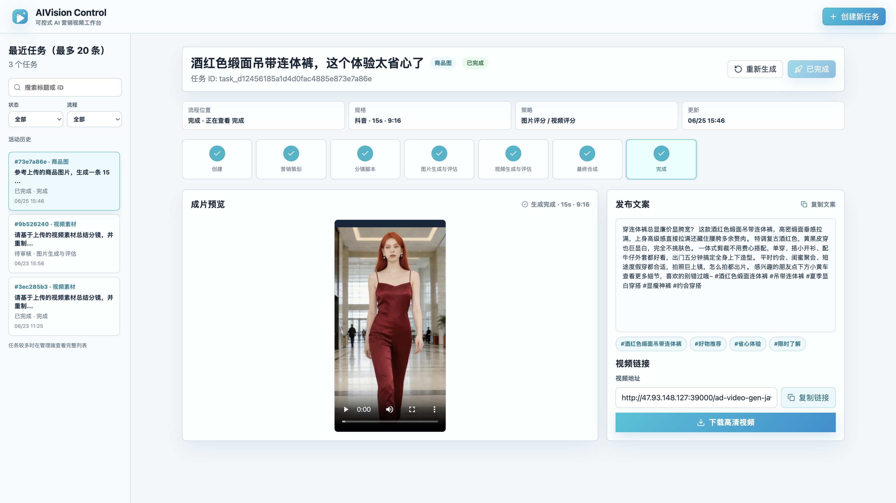

# ad-video-gen-java

**AIVision Control** — 可控式 AI 营销视频工作台。上传商品图或参考视频，经多 Agent 编排完成策划、分镜、图片/视频生成与评估，人工确认后 FFmpeg 合成成片，并自动生成发布文案与话题标签。

后端 **Spring Boot 3 + H2**，前端 **React + Vite + TypeScript**，模型接入火山方舟（Doubao / Seedream / Seedance）。

---

## 界面预览

| 创建任务 | 图片生成与评估 |
|:---:|:---:|
|  |  |

| 重燃抽屉 | 视频生成与评估 |
|:---:|:---:|
|  |  |

| 完成页 |
|:---:|
|  |

---

## 项目简介

本项目将「理解需求 → 写脚本 → 生图 → 生视频 → 合成发布」拆成**可审核、可回退**的多阶段流水线，适合两类场景：

| 工作流 | 标识 | 输入 | 流程特点 |
|--------|------|------|----------|
| **商品图生成广告** | `product_image_ad` | 商品图 + 文字需求 | 含营销策划 → 分镜脚本 → 图片/视频候选 → 合成 |
| **视频素材拆解重制** | `video_storyboard_ad` | 参考视频 + 文字需求 | 跳过营销策划，先做视频理解与分镜，再进入图片/视频生成 |

**核心交互原则**（与当前前端实现一致）：

- **一阶段一主操作**：顶栏主 CTA 为「进入下一步」，阶段内底部保存，不再重复「保存草稿」
- **先保存再前进**：有未保存修改时点击「进入下一步」会弹出确认（保存并继续 / 放弃 / 取消）
- **人机协同**：每组分镜支持多候选图片/视频，可开启 AI 评分辅助选片
- **回顾只读**：点击 Stepper 查看历史节点时为只读，需「返回当前阶段」才能继续编辑
- **重燃**：右侧抽屉从指定阶段修改输入参数并重跑后续流程；图片/视频重燃表单**仅展示参数**，不展示已生成候选素材

---

## 技术栈

| 层级 | 技术 |
|------|------|
| 后端 | Java 17、Spring Boot 3.3、H2、FFmpeg |
| 前端 | React 18、Vite 5、TypeScript、Lucide Icons |
| LLM | Doubao-Seed-1.6（理解、Agent 推理） |
| 图像 | Doubao-Seedream 4.5 pro（文生图 / 参考图生图） |
| 视频 | Doubao-Seedance 1.0 pro（图文生视频） |
| 存储 | S3 兼容对象存储（RustFS / MinIO 等） |

---

## 前端工作台（当前实现）

### 布局

- **顶栏**：品牌「AIVision Control」、创建新任务
- **左侧栏**：最近任务（最多 20 条）、搜索、按状态/流程筛选
- **主画布**：当前任务阶段内容；顶栏含任务摘要、Stepper、重新生成、进入下一步

### 创建任务页

- 左侧 **流程说明**（素材输入 → 营销策划 → … → 人工重燃）
- 中间 **素材与需求**：切换「商品图 / 视频素材」工作流，上传或填写链接
- 右侧 **生成配置**：平台、时长、比例、风格标签、候选数量、图片/视频评分、自动确认
- 未上传素材时「开始生成」禁用并提示

### 分镜审核（ShotReviewCard）

图片/视频评估阶段采用**按分镜聚合**的单列卡片：

- 每组展示候选网格（图片 `ImageCandidateGrid` / 视频 `VideoCandidateGrid`，各候选独立播放器）
- 进度条显示「已选 N/M 组」，支持「展开全部」一键展开评分依据与分镜详情
- 底部 **阶段保存条**（有未保存修改时高亮）：保存分镜 / 保存图片选择 / 保存视频选择

### 重燃抽屉

- 选择重燃阶段与原因，编辑该阶段真正使用的输入（分镜参数、生成配置等）
- **图片/视频生成阶段**不展示历史候选素材，仅编辑参数后「应用重燃」
- 重燃请求会合并分镜字段（未改动的参考图等大字段不会重复上传）

### 完成页

- 成片预览、发布文案、话题标签、分享链接、下载高清视频

---

## 后端流程

### 多 Agent

| Agent | 职责 |
|-------|------|
| Market | 目标人群、卖点、创意策略（商品图流程） |
| Director | 标题、脚本、分镜提示词 |
| VideoStoryboard | 参考视频分镜理解（视频素材流程） |
| Evaluate | 候选图片/视频评分与依据 |
| Multimedia | Seedream 分镜图 → Seedance 分镜视频 |
| Release | 发布文案、话题、成片链接 |

提示词位于 `src/main/resources/prompts/`，由 `PromptService` 按 `## PROMPT_XXX` 段落加载。

### 状态机

后端细粒度阶段在前端 **归并展示**（`canonicalStage`）：

| 后端阶段 | 前端 Stepper 展示 |
|----------|-------------------|
| `IMAGE_EVALUATING` / `IMAGE_SELECTING` | 图片生成与评估 |
| `VIDEO_EVALUATING` / `VIDEO_SELECTING` | 视频生成与评估 |

**商品图流程** Stepper：

```text
创建 → 营销策划 → 分镜脚本 → 图片生成与评估 → 视频生成与评估 → 最终合成 → 完成
```

**视频素材流程** Stepper（无营销策划）：

```text
创建 → 视频理解与分镜 → 图片生成与评估 → 视频生成与评估 → 最终合成 → 完成
```

任务状态：`RUNNING`（生成中，画布显示遮罩自动刷新）→ `WAITING_REVIEW`（待人工确认）→ `SUCCESS` / `FAILED`。

默认逐步推进；创建时开启「自动确认」且满足条件时可自动进入下一步。保存分镜/选择或重燃后，会清空受影响的后续产物。

---

## 快速开始

### 一键打包运行

```bash
mvn clean package
java -jar target/ad-video-gen-java-0.0.1-SNAPSHOT.jar
```

访问：`http://localhost:8080/`（前端已打入 JAR 的 `static` 目录）

### 前后端分离开发

```bash
# 终端 1
mvn spring-boot:run

# 终端 2
cd frontend && npm install && npm run dev
```

- 前端：`http://localhost:8002/`
- 开发态 API **直连** `http://127.0.0.1:8080`（可通过 `VITE_API_BASE` 覆盖）
- 后端需已启动，否则接口报连接失败

---

## 环境变量

```bash
export ARK_API_KEY=你的方舟APIKey
export LLM_MODEL=doubao-seed-1-6-250615
export LLM_ENDPOINT_ID=你的LLM接入点ID

export IMAGE_MODEL=doubao-seedream-4-5-pro
export CGT_ENDPOINT_ID=你的Seedream接入点ID
export IMAGE_GENERATION_ENABLED=true

export VIDEO_MODEL=doubao-seedance-1-0-pro
export T2V_ENDPOINT_ID=你的Seedance接入点ID
export VIDEO_GENERATION_ENABLED=true

export PUBLIC_BASE_URL=http://localhost:8080
export FFMPEG_BINARY=ffmpeg
export FFMPEG_OUTPUT_DIR=./data/final-videos

export S3_ENDPOINT=http://127.0.0.1:9000
export S3_PUBLIC_BASE_URL=http://127.0.0.1:9000
export S3_ACCESS_KEY=你的AccessKey
export S3_SECRET_KEY=你的SecretKey
export S3_BUCKET=ad-video-gen-java
export S3_REGION=us-east-1
export S3_PATH_STYLE_ACCESS=true
export S3_AUTO_CREATE_BUCKET=true
export S3_OBJECT_EXPIRATION_DAYS=7
```

| 变量 | 说明 |
|------|------|
| `S3_ACCESS_KEY` / `S3_SECRET_KEY` | 未配置时上传返回 mock URL，便于本地联调 |
| `S3_OBJECT_EXPIRATION_DAYS` | `uploads/` 前缀过期天数；`final-videos/` 不过期 |
| `IMAGE_GENERATION_ENABLED` / `VIDEO_GENERATION_ENABLED` | 关闭时使用本地兜底内容 |

---

## API 概览

基础路径：`/api/video-tasks`

| 方法 | 路径 | 说明 |
|------|------|------|
| `POST` | `/api/video-tasks` | 创建任务 |
| `GET` | `/api/video-tasks` | 任务列表（侧边栏） |
| `GET` | `/api/video-tasks/{id}` | 任务详情 |
| `POST` | `/api/video-tasks/{id}/start` | 启动（CREATED → 首阶段） |
| `POST` | `/api/video-tasks/{id}/advance` | 进入下一步 |
| `POST` | `/api/video-tasks/{id}/context` | 保存分镜/视频参数编辑 |
| `POST` | `/api/video-tasks/{id}/select-assets` | 保存图片/视频选择 |
| `POST` | `/api/video-tasks/{id}/regenerate` | 从指定阶段重燃 |
| `POST` | `/api/video-tasks/upload-image` | 上传商品图 |
| `POST` | `/api/video-tasks/upload-video` | 上传参考视频 |

### 创建任务（商品图）

```bash
curl -X POST http://localhost:8080/api/video-tasks \
  -H 'Content-Type: application/json' \
  -d '{
    "workflowType": "product_image_ad",
    "inputType": "product_image",
    "text": "参考商品图片，生成一条 15 秒带货广告视频。",
    "imageUrls": ["https://example.com/product.jpg"],
    "platform": "douyin",
    "duration": 15,
    "aspectRatio": "9:16",
    "style": "电影感",
    "imageScoringEnabled": true,
    "videoScoringEnabled": true,
    "autoConfirmEnabled": false,
    "generateImageCount": 4,
    "generateVideoCount": 2
  }'
```

### 重燃

```bash
curl -X POST http://localhost:8080/api/video-tasks/{taskId}/regenerate \
  -H 'Content-Type: application/json' \
  -d '{
    "fromStage": "IMAGE_GENERATING",
    "reason": "调整分镜提示词后重跑",
    "shots": []
  }'
```

可选 `fromStage`：`MARKET_PLANNING`（仅商品图）、`SHOT_SCRIPT_GENERATING`、`IMAGE_GENERATING`、`VIDEO_GENERATING`、`FINAL_COMPOSING`。

---

## Docker 部署

```bash
mkdir -p docker/ffmpeg
cp /path/to/ffmpeg-master-latest-linux64-gpl.tar.xz docker/ffmpeg/

mvn clean package
docker build -t ad-video-gen-java .

docker run -d \
  --name ad-video-gen-java \
  -p 48080:48080 \
  -e ARK_API_KEY=... \
  -e LLM_ENDPOINT_ID=... \
  -e CGT_ENDPOINT_ID=... \
  -e T2V_ENDPOINT_ID=... \
  -e PUBLIC_BASE_URL=http://your-host:48080 \
  -e S3_ENDPOINT=http://host.docker.internal:9000 \
  -e S3_ACCESS_KEY=... \
  -e S3_SECRET_KEY=... \
  -v "$(pwd)/docker-data/db:/app/data/db" \
  -v "$(pwd)/docker-data/videos:/app/data/videos" \
  ad-video-gen-java
```

| 地址 | 说明 |
|------|------|
| `http://localhost:48080/` | 工作台 |
| `http://localhost:48080/h2-console` | H2 控制台 |

---

## 数据持久化

| 项 | 值 |
|----|-----|
| 数据文件 | `./data/ad-video-gen.mv.db` |
| JDBC | `jdbc:h2:file:./data/ad-video-gen;MODE=MySQL;AUTO_SERVER=TRUE` |
| 用户名 / 密码 | `sa` / 空 |

- `video_task`：任务元数据、`request_json`
- `video_task_context`：完整上下文 `context_json`（分镜、候选组、选择结果、成片等）

---

## 项目结构

```text
ad-video-gen-java/
├── docs/screenshots/          # README 界面截图
├── docs/ui-review/            # 交互与 UI 设计文档
├── frontend/                  # React 工作台（main.tsx 单文件组件）
├── src/main/java/.../advideo/
│   ├── agent/                 # 各阶段 Agent
│   ├── client/                # 方舟 API 客户端
│   ├── orchestrator/          # 工作流编排、重燃、状态机
│   ├── controller/            # REST API
│   └── service/               # 存储、FFmpeg、Prompt
└── src/main/resources/prompts/
```

---

## 相关文档

- [交互设计](docs/ui-review/interaction-design.md)
- [UI 设计规范](docs/ui-review/ui-design-spec.md)
- [图片/视频阶段审查](docs/ui-review/image-video-stage-review.md)
